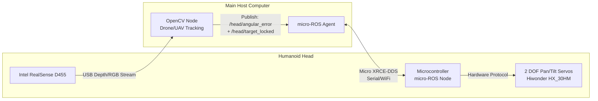

```mermaid
flowchart LR
    subgraph Humanoid Head
        CAM[Intel RealSense D455]
        MOT[2 DOF Pan/Tilt Servos<br>Hiwonder HX_30HM]
        MCU[Microcontroller<br>micro-ROS Node]
        
        MCU -->|Hardware Protocol| MOT
    end

    subgraph Main Host Computer
        CV[OpenCV Node<br>Drone/UAV Tracking]
        AGENT[micro-ROS Agent]
    end

    %% The Vision Pipeline
    CAM -->|USB Depth/RGB Stream| CV
    
    %% The Control Loop (rate / visual servoing)
    CV -->|Publish: /head/angular_error<br>+ /head/target_locked| AGENT
    AGENT <-->|Micro XRCE-DDS<br>Serial/WiFi| MCU
```